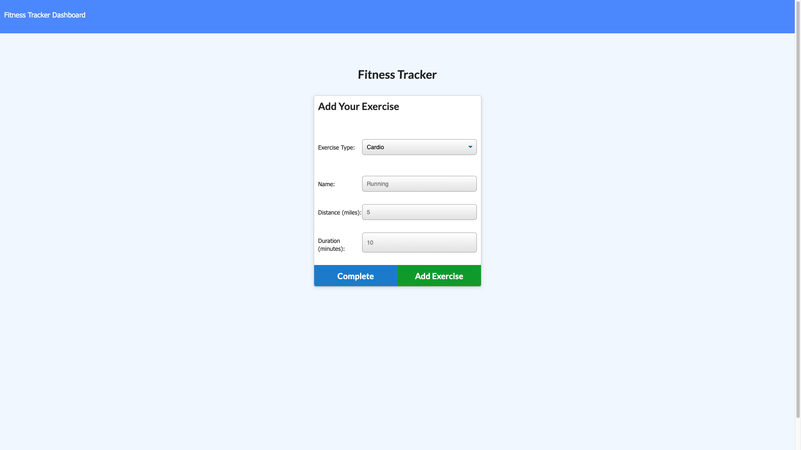
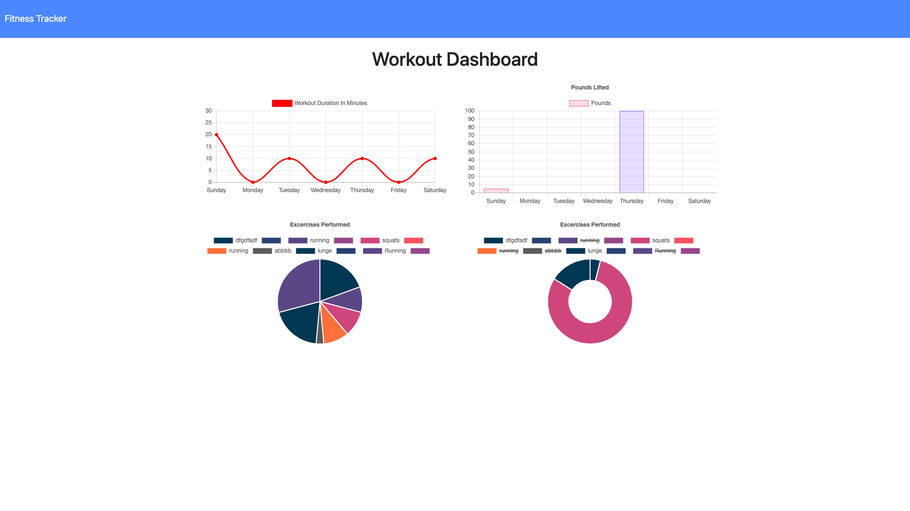

# Workout-Tracker
The workout app was created using HTML, JS, and MongooseDB. The app allows users to post their workouts by date and exercise type. The two exercise types are Cardio and Resistance, from there users will input specific parameters for their exercise (i.e name, distance, duration, weight). In the Fitness dashboard, all workouts in the week would be posted for weekly metrics. 

